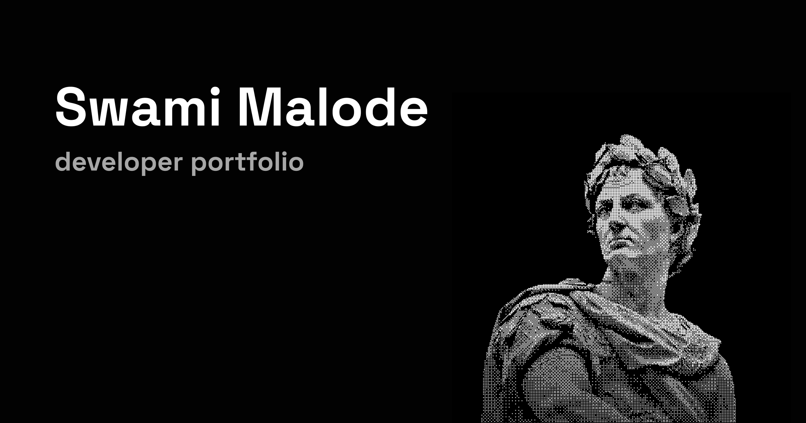

# Swami's Portfolio

[swamimalode.online](https://swamimalode.online) – A personal portfolio to showcase my work, projects, and UI/UX designs as a Full Stack Developer and Design Engineer.

---

## Screenshot
  

---

## Overview

This is a minimal, modern, and responsive portfolio built with the latest web technologies. It includes:

- Portfolio showcase
- Component registry for reusable UI elements (coming soon)
- SEO & PWA support

---

## Live Site

Check it out: [swamimalode.online](https://swamimalode.online)

---

## Tech Stack

- **Framework:** Next.js 15 + TypeScript  
- **Styling:** Tailwind CSS v4  
- **Deployment:** Vercel  
- **Icons:** Lucide  
- **Animations:** Framer Motion  

---

## Features

- **Clean & Modern Design** 
- **SEO Optimized** 
- **PWA Ready** 
- **Dynamic OG Images**: For rich social previews  
- **Component Registry**: Easily showcase and document reusable components  

---

## Development

To run locally:

```bash
# Clone the repo
git clone https://github.com/swamimalode07/portfolio.git
cd portfolio

# Install dependencies
pnpm install   # or use npm install if you prefer


# Run development server
pnpm dev       # or npm run dev
